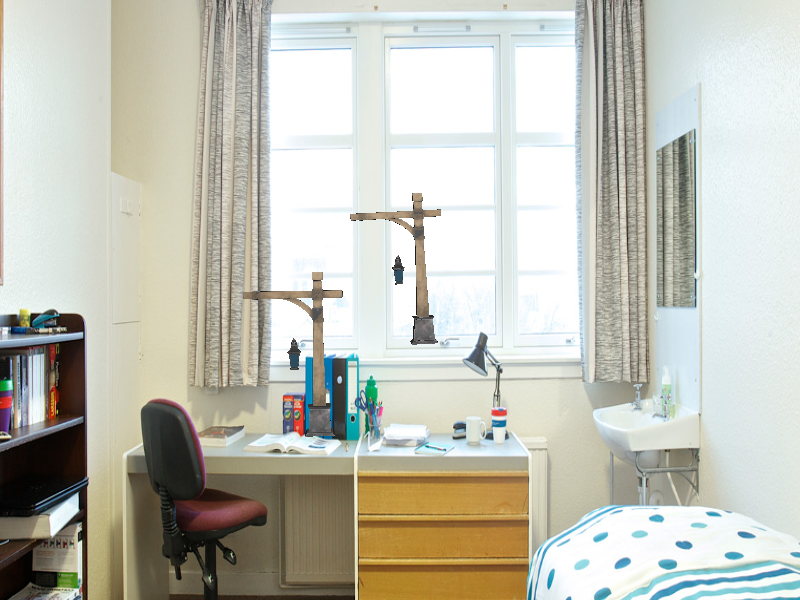
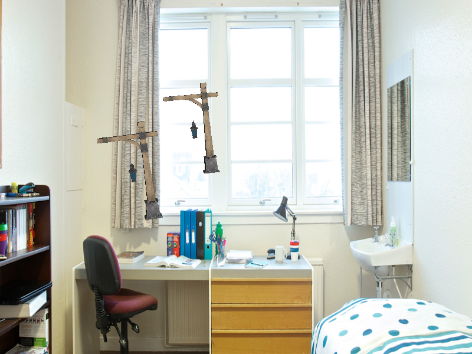

# ofigen-cpp
C++ implementation of OFIGEN, a Blender plugin for creating training data for neural networks learning optical flow.
This version is standalone and optimized for performance to enable creating big datasets in a short-time.

## Features
* Read in backgrounds as image files, which will provide a background for the scene
* Read in 3D models as `.glb`/`.glTF` files, that will be placed on the scene
* Move the objects on the scene randomly
* Render the result of one iteration of movement to an image on the GPU
* Provide the result in a text file, that will be used by the neural network for learning
* Easy configuration using a config file for setting backgrounds, models, random parameters, etc.
* Ability to see the rendered pictures real-time on the screen

## Compilation

The project uses CMake and requires a C++17 compiler (tested with MSVC). To create build files, run:
```
mkdir build && cd build
cmake ..
```
Then open the `.sln` generated by CMake. Visual Studio will take care of the rest and compile/run the application.

## Dependencies

The project uses [Magnum](https://magnum.graphics/) for graphics and model loading. For reading/writing JSON, [Nlohmann's JSON](https://github.com/nlohmann/json) library is used. Creating `.png`s is achieved using [libpng](http://www.libpng.org/pub/png/libpng.html) and its C++ wrapper, [png++](https://www.nongnu.org/pngpp/). 

## Setup

To start using the application, the following files are required:
* configuration file for setting different variables and models/background
* background image (`.jpg`, `.png`)
* folder containing the 3D models to be used during training (`.glb`, `.glTF` with its `.bin` and textures)

The config file supports the following settings:
* `num_of_iterations`: number of movement steps (this is how many files the program will generate)
* `background_name`: background texture filename
* `models_folder`: name of the folder that contains the models
* `num_of_objects`: how many objects should the application place on the scene (randomly)
* `object_placement_min`: a 3D vector for specifying the minimum position of an object (`{"x": 1, "y": 1, "z": 1}`)
* `object_placement_max`: a 3D vector for specifying the maximum position of an object (`{"x": 10, "y": 10, "z": 10}`)
    * `z` should have a negative value as the camera is in `(0, 0, 0)` and is looking at the negative-Z direction
* `object_move_coeff`: coefficient for moving
* `object_move_constraint`: 3D vector for specifying the magnitude of movement for each axis (`{"x": 1, "y": 1, "z": 1}`)
* `object_rot_coeff`: coefficient for rotation
* `object_rot_constraint`: 3D vector for specyfing the magnitude of rotation for each axis ((`{"x": 1, "y": 1, "z": 1}`))
* `out_folder`: name of the folder where files get dumped (the app will create it if it does not exist)
* `out_file`: file name pattern for the output files (without extension)

## Functionality

After supplying the required files, the program can be run using the following command: `OFIGEN.exe --config config.json`, where `config.json` is the created JSON file.

After starting, the app loads every model found in the supplied models folder, then places the required number of objects on the scene, and begins to move them randomly for the supplied `n` iterations, after it closes. After each movement, a `.png` and `.json` is created inside the output directory, providing information about the movement that just occured. These files are suffixed with the iteration number for easy access.

The output JSON provides the following data for every object:
* `old_position`: the position of the object on the last frame
* `mew_position`: the position of the object on the current frame
* `old_orientation`: the orientation of the object on the last frame
* `mew_orientationi`: the orientation of the object on the current frame
* `position_delta`: the change in position
* `orientation_delta`: the change in orientation

## Inner Workings

Model/Texture loading is done using the [Magnum-Plugins](https://github.com/mosra/magnum-plugins) library, that provides importers for various object and image file types. The reason behind choosing `.glTF` as the input format, is because the project's `.obj` loader is very rudimentary and does not allow the importing of materials or textures. However, Blender can export `.glTF` and `.glb`, so it is not a big issue.

Random number generation is achieved by utilizing the `<random>` header from C++11, which is much better than the outdated `rand()` function.

To create the output image, Magnum provides a method named `read()`, that can export the values from a framebuffer into a given image. Using this, the content of the default framebuffer is copied into an image, that gets serialized in `.png` using libpng.

Various file system accesses, like traversing the models or creating the output folder is done via the new `<filesystem>` header.

## Example Output

Below are the first 3 iterations of a sample output.


```json
{
    "iteration": 0,
    "objectData": [
        {
            "name": "models\\Lantern.glb_0",
            "new_orientation": {
                "x": 0.12240372598171234,
                "y": 0.17267867922782898,
                "z": 0.052778005599975586
            },
            "new_position": {
                "x": -4.959590911865234,
                "y": -5.553534984588623,
                "z": -40.35729217529297
            },
            "old_orientation": {
                "x": 0.037744078785181046,
                "y": 0.08190283179283142,
                "z": 0.017436761409044266
            },
            "old_position": {
                "x": -5.058011054992676,
                "y": -5.61879301071167,
                "z": -40.45342254638672
            },
            "orientation_delta": {
                "x": 0.0846596509218216,
                "y": 0.09077584743499756,
                "z": 0.03534124419093132
            },
            "position_delta": {
                "x": 0.0984201431274414,
                "y": 0.06525802612304688,
                "z": 0.09613037109375
            }
        },
        {
            "name": "models\\Lantern.glb_1",
            "new_orientation": {
                "x": 0.12060520052909851,
                "y": 0.10554720461368561,
                "z": 0.08114501088857651
            },
            "new_position": {
                "x": 1.7655489444732666,
                "y": -0.765845000743866,
                "z": -46.6414680480957
            },
            "old_orientation": {
                "x": 0.075420081615448,
                "y": 0.034642335027456284,
                "z": 0.05266579985618591
            },
            "old_position": {
                "x": 1.6719810962677002,
                "y": -0.855453610420227,
                "z": -46.668148040771484
            },
            "orientation_delta": {
                "x": 0.04518511891365051,
                "y": 0.07090486586093903,
                "z": 0.028479211032390594
            },
            "position_delta": {
                "x": 0.0935678482055664,
                "y": 0.08960860967636108,
                "z": 0.02667999267578125
            }
        }
    ]
}
```

```json
{
    "iteration": 1,
    "objectData": [
        {
            "name": "models\\Lantern.glb_0",
            "new_orientation": {
                "x": 0.19349026679992676,
                "y": 0.21442459523677826,
                "z": 0.12604911625385284
            },
            "new_position": {
                "x": -4.94083833694458,
                "y": -5.480167388916016,
                "z": -40.31053161621094
            },
            "old_orientation": {
                "x": 0.12240372598171234,
                "y": 0.17267867922782898,
                "z": 0.052778005599975586
            },
            "old_position": {
                "x": -4.959590911865234,
                "y": -5.553534984588623,
                "z": -40.35729217529297
            },
            "orientation_delta": {
                "x": 0.07108654081821442,
                "y": 0.04174591600894928,
                "z": 0.07327111065387726
            },
            "position_delta": {
                "x": 0.018752574920654297,
                "y": 0.07336759567260742,
                "z": 0.04676055908203125
            }
        },
        {
            "name": "models\\Lantern.glb_1",
            "new_orientation": {
                "x": 0.1713566929101944,
                "y": 0.15656255185604095,
                "z": 0.10819433629512787
            },
            "new_position": {
                "x": 1.8004333972930908,
                "y": -0.7602636814117432,
                "z": -46.577598571777344
            },
            "old_orientation": {
                "x": 0.12060520052909851,
                "y": 0.10554720461368561,
                "z": 0.08114501088857651
            },
            "old_position": {
                "x": 1.7655489444732666,
                "y": -0.765845000743866,
                "z": -46.6414680480957
            },
            "orientation_delta": {
                "x": 0.050751492381095886,
                "y": 0.05101534724235535,
                "z": 0.02704932540655136
            },
            "position_delta": {
                "x": 0.03488445281982422,
                "y": 0.005581319332122803,
                "z": 0.06386947631835938
            }
        }
    ]
}
```

```json
{
    "iteration": 2,
    "objectData": [
        {
            "name": "models\\Lantern.glb_0",
            "new_orientation": {
                "x": 0.2772594690322876,
                "y": 0.28991490602493286,
                "z": 0.1266762912273407
            },
            "new_position": {
                "x": -4.860235214233398,
                "y": -5.408869743347168,
                "z": -40.248573303222656
            },
            "old_orientation": {
                "x": 0.19349026679992676,
                "y": 0.21442459523677826,
                "z": 0.12604911625385284
            },
            "old_position": {
                "x": -4.94083833694458,
                "y": -5.480167388916016,
                "z": -40.31053161621094
            },
            "orientation_delta": {
                "x": 0.08376920223236084,
                "y": 0.0754903107881546,
                "z": 0.000627174973487854
            },
            "position_delta": {
                "x": 0.08060312271118164,
                "y": 0.07129764556884766,
                "z": 0.06195831298828125
            }
        },
        {
            "name": "models\\Lantern.glb_1",
            "new_orientation": {
                "x": 0.17824332416057587,
                "y": 0.21314994990825653,
                "z": 0.20454753935337067
            },
            "new_position": {
                "x": 1.8887747526168823,
                "y": -0.6733759045600891,
                "z": -46.48918914794922
            },
            "old_orientation": {
                "x": 0.1713566929101944,
                "y": 0.15656255185604095,
                "z": 0.10819433629512787
            },
            "old_position": {
                "x": 1.8004333972930908,
                "y": -0.7602636814117432,
                "z": -46.577598571777344
            },
            "orientation_delta": {
                "x": 0.00688663125038147,
                "y": 0.056587398052215576,
                "z": 0.0963532030582428
            },
            "position_delta": {
                "x": 0.0883413553237915,
                "y": 0.08688777685165405,
                "z": 0.088409423828125
            }
        }
    ]
}
```